# Actividad Práctica — Instalación de n8n con Docker y Primer "Hola Mundo"

> **Integrante(s):** `Diego Mantilla`  
> **Método de instalación utilizado:** Docker — Opción 2

---

## Tabla de Contenidos

1. [Requisitos Previos](#requisitos-previos)
2. [Proceso de Instalación](#proceso-de-instalación)
3. [Problemas Encontrados y Soluciones](#problemas-encontrados-y-soluciones)
4. [Workflow "Hola Mundo"](#workflow-hola-mundo)
5. [Punto Extra — Integración con Discord](#punto-extra--integración-con-discord)
6. [Evidencias](#evidencias)
7. [Reflexión Final](#reflexión-final)

---

## Requisitos Previos

Antes de instalar n8n con Docker, se verificó que el sistema contara con las siguientes herramientas:

| Herramienta | Versión Requerida | Versión Instalada | Estado |
|-------------|-------------------|-------------------|--------|
| Docker Desktop | ≥ 24.x | `29.5.2` | ✔ |
| Docker Compose | ≥ 2.x (incluido en Docker Desktop) | `5.1.3` | ✔ |
| Sistema Operativo | Windows 10/11, macOS, Linux | `Windows 11` | ✔ |

> **¿Por qué Docker?** Docker permite ejecutar n8n dentro de un contenedor aislado del sistema operativo. Esto significa que n8n tiene su propio entorno controlado, independientemente de lo que esté instalado en la máquina. Es la opción más utilizada en entornos profesionales y de producción.

### Verificación de Docker instalado

Para confirmar que Docker estaba correctamente instalado y en ejecución, se ejecutaron los siguientes comandos en la terminal:

```bash
docker --version
docker compose version
docker ps
```

El comando `docker ps` lista los contenedores activos. Si Docker está corriendo correctamente, muestra una tabla (aunque esté vacía al inicio).

> Comprobación del docker.
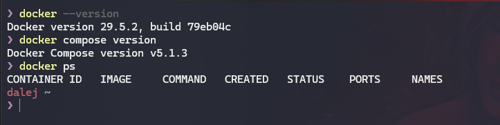

---

## Proceso de Instalación

Se utilizó la **Opción 2 — Docker con docker-compose**, que es el método más profesional y cercano a entornos de producción real.

### Paso 1 — Crear la carpeta del proyecto

Se creó una carpeta dedicada para el proyecto y se accedió a ella:

```bash
mkdir n8n-docker
cd n8n-docker
```

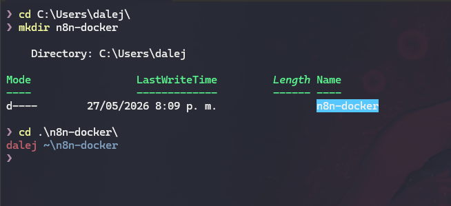

---

### Paso 2 — Crear el archivo `docker-compose.yml`

Dentro de la carpeta `n8n-docker`, se creó el archivo `docker-compose.yml` con el siguiente contenido. Este archivo le indica a Docker cómo levantar el servicio de n8n:

```yaml
version: "3.8"

services:
  n8n:
    image: docker.n8n.io/n8nio/n8n
    container_name: n8n
    restart: unless-stopped
    ports:
      - "5678:5678"
    environment:
      - N8N_BASIC_AUTH_ACTIVE=false
      - N8N_HOST=localhost
      - N8N_PORT=5678
      - N8N_PROTOCOL=http
      - GENERIC_TIMEZONE=America/Bogota
      - TZ=America/Bogota
    volumes:
      - n8n_data:/home/node/.n8n

volumes:
  n8n_data:
```

**Explicación de cada sección del archivo:**

| Sección | Descripción |
|---------|-------------|
| `image` | La imagen oficial de n8n publicada en su registro |
| `container_name` | Nombre del contenedor para identificarlo fácilmente |
| `restart: unless-stopped` | El contenedor se reinicia automáticamente si el equipo se reinicia |
| `ports: "5678:5678"` | Mapea el puerto 5678 del contenedor al puerto 5678 del equipo local |
| `environment` | Variables de entorno para configurar n8n (zona horaria, host, puerto) |
| `volumes: n8n_data` | Volumen persistente donde n8n guarda todos los workflows y credenciales |

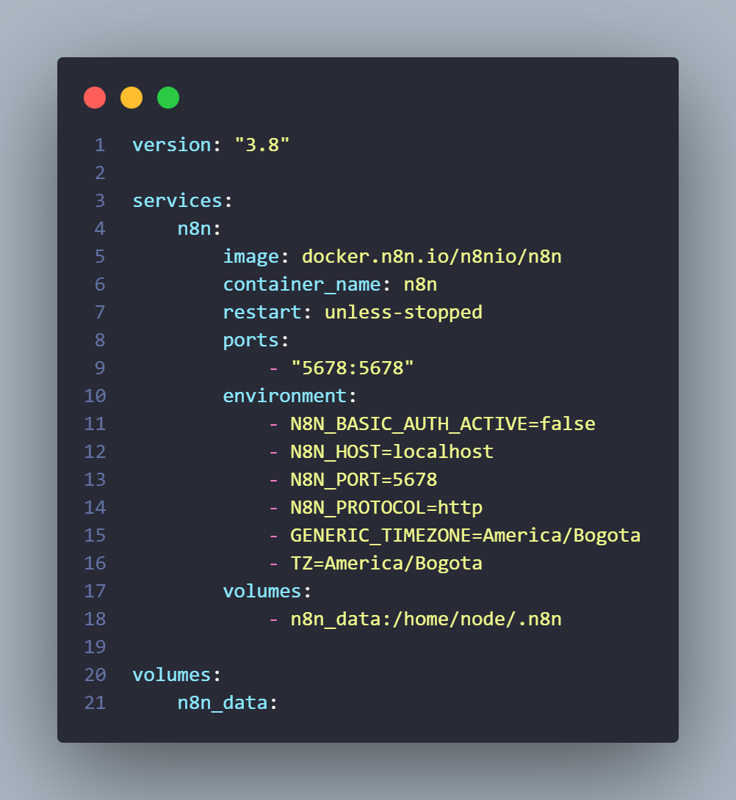

---

### Paso 3 — Levantar el contenedor con Docker Compose

Con el archivo `docker-compose.yml` creado, se ejecutó el siguiente comando para descargar la imagen de n8n e iniciar el contenedor:

```bash
docker compose up -d
```

**¿Qué hace este comando?**
- `docker compose up` — Lee el archivo `docker-compose.yml` y crea/inicia los servicios definidos.
- `-d` (detached) — Ejecuta el contenedor en segundo plano, liberando la terminal para seguir usándola.

La primera vez, Docker descarga la imagen oficial de n8n desde internet (aproximadamente 500 MB). Este proceso puede tardar varios minutos dependiendo de la conexión.

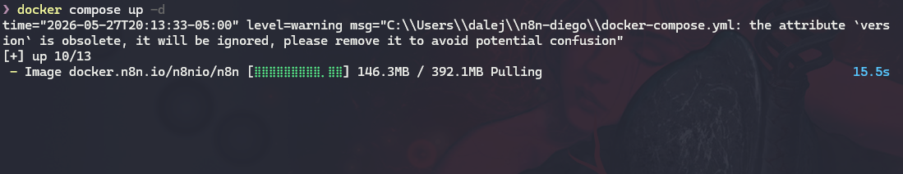
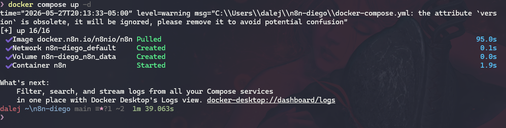

---

### Paso 4 — Verificar que el contenedor está corriendo

Para confirmar que n8n quedó activo, se ejecutó:

```bash
docker ps
```

Este comando muestra todos los contenedores en ejecución. Se debe ver el contenedor `n8n` con el estado `Up` y el puerto `0.0.0.0:5678->5678/tcp`.

```
CONTAINER ID   IMAGE                      COMMAND                  CREATED        STATUS        PORTS                    NAMES
xxxxxxxxxxxx   docker.n8n.io/n8nio/n8n   "tini -- /docker-ent…"   1 minute ago   Up 1 minute   0.0.0.0:5678->5678/tcp   n8n
```

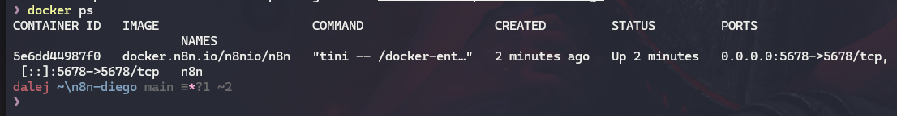

---

### Paso 5 — Acceso al dashboard de n8n

Se abrió el navegador web y se accedió a:

```
http://localhost:5678
```

La primera vez, n8n muestra un formulario de registro para crear la cuenta de administrador local. El cual fue rellenado y posteriormente se accedió al dashboard.

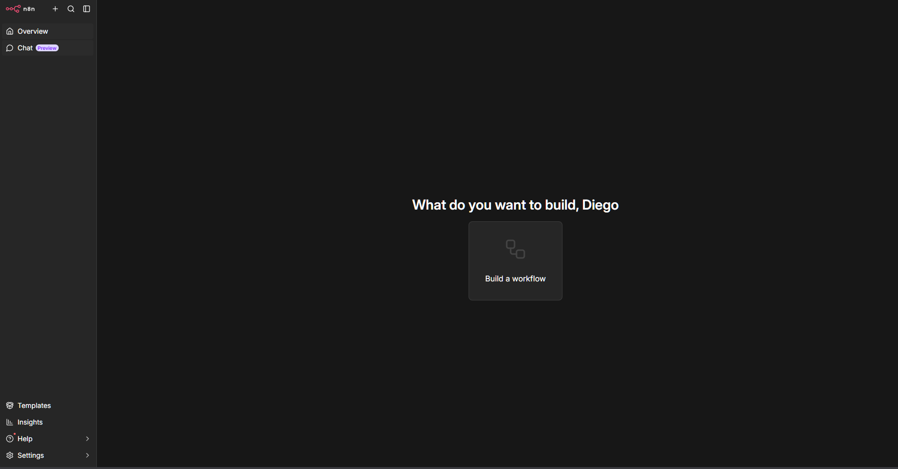

---

### Paso 6 — Comandos útiles para gestionar el contenedor

Una vez instalado, estos son los comandos más útiles para administrar n8n con Docker:

```bash
# Ver logs en tiempo real (útil para depurar errores)
docker logs -f n8n

# Detener n8n sin eliminar el contenedor
docker compose stop

# Iniciar n8n nuevamente
docker compose start

# Detener y eliminar el contenedor (los datos persisten en el volumen)
docker compose down

# Actualizar n8n a la última versión
docker compose pull
docker compose up -d
```

---

## Problemas Encontrados y Soluciones

### Problema 1 — `Cannot connect to the Docker daemon`

**Descripción:**
Al ejecutar el comando:

```bash
docker ps
```

apareció el siguiente error:

```bash
failed to connect to the docker API at npipe:////./pipe/dockerDesktopLinuxEngine; check if the path is correct and if the daemon is running: open //./pipe/dockerDesktopLinuxEngine: The system cannot find the file specified.
```

Esto ocurrió porque Docker Desktop aún no estaba iniciado correctamente y el motor de Docker (Docker Engine) no se encontraba en ejecución.

**Solución aplicada:**
Se abrió Docker Desktop manualmente desde el menú de inicio y se esperó a que terminara de cargar completamente. Después de que el estado cambió a "Docker Desktop is running", el comando `docker ps` funcionó correctamente.

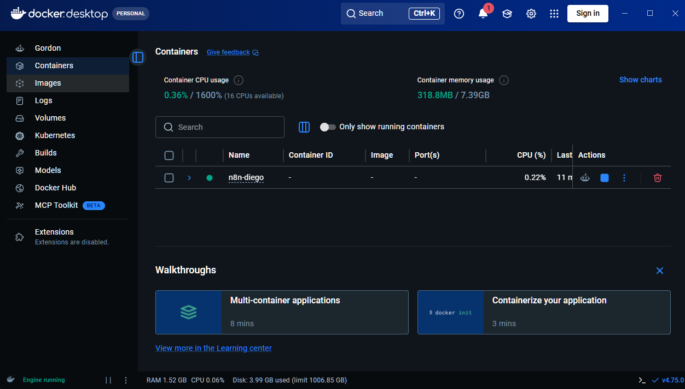

---

## Workflow "Hola Mundo"

### Descripción del Workflow

Se construyó un workflow básico compuesto por **2 nodos** que, al ejecutarse manualmente, genera y muestra el mensaje `"Hola Mundo desde n8n — This shit working!"`.

### Nodos utilizados

#### Nodo 1 — Manual Trigger (Disparador Manual)

| Propiedad | Valor |
|-----------|-------|
| **Tipo** | Manual Trigger |
| **Nombre** | `When clicking "Execute workflow"` |
| **Función** | Inicia el workflow manualmente al presionar el botón de ejecución |
| **Configuración** | Sin parámetros adicionales — solo activa el flujo |

**¿Qué hace?** Es el punto de partida del workflow. Cuando el usuario hace clic en "Execute Workflow" dentro del editor de n8n, este nodo envía una señal de inicio hacia el siguiente nodo. En entornos de producción, este trigger podría reemplazarse por un Webhook, un schedule (cron), o un evento externo.

---

#### Nodo 2 — Set (Configurar datos)

| Propiedad | Valor |
|-----------|-------|
| **Tipo** | Set |
| **Nombre** | `Hola Mundo` |
| **Función** | Crea un objeto JSON con el mensaje personalizado |

**Configuración del nodo Set:**

Se configuraron los siguientes campos en el nodo:

```json
{
  "mensaje": "Hola Mundo desde n8n",
  "estado": "This shit working!",
  "instalacion": "Docker",
  "autor": "Diego",
  "fecha": "2025"
}
```

**¿Qué hace?** El nodo Set permite definir, modificar o sobreescribir los datos que fluyen a través del workflow. En este caso, crea un objeto JSON con el mensaje de bienvenida. La salida de este nodo puede ser consumida por nodos posteriores.

---

### Diagrama del Workflow Base

```
┌─────────────────────────┐        ┌─────────────────────────┐
│                         │        │                         │
│   Manual Trigger        │ ──────▶│   Set: "Hola Mundo"     │
│   (Inicio manual)       │        │   (Genera el mensaje)   │
│                         │        │                         │
└─────────────────────────┘        └─────────────────────────┘
         Paso 1                              Paso 2
```

### Cómo crear el workflow — Guía paso a paso

1. En el dashboard de n8n (`http://localhost:5678`), hacer clic en **"New Workflow"**.
2. Hacer clic en el botón **"+"** en el canvas para añadir el primer nodo.
3. Buscar y seleccionar **"Manual Trigger"**.
4. Hacer clic en el botón **"+"** que aparece a la derecha del nodo Manual Trigger.
5. Buscar y seleccionar **"Set"**.
6. Hacer clic en el nodo **Set** para abrirlo y configurarlo:
   - Cambiar el modo a **"Add Field"**
   - Agregar campo `String`: `mensaje` → `Hola Mundo desde n8n`
   - Agregar campo `String`: `estado` → `This shit working!`
   - Agregar campo `String`: `instalacion` → `Docker`
7. Hacer clic en **"Save"** (ícono de disco) para guardar con el nombre `Hola Mundo`.
8. Hacer clic en **"Execute Workflow"** para ejecutarlo.

---

## Punto Extra — Integración con Discord

Como punto extra, se extendió el workflow para que, además de generar el mensaje internamente, lo envíe automáticamente a un canal de Discord usando un **Webhook**.

### ¿Qué es un Webhook de Discord?

Un Webhook es una URL especial que Discord proporciona para que aplicaciones externas puedan enviar mensajes a un canal sin necesidad de un bot completo. n8n utiliza esta URL para hacer una solicitud HTTP POST con el mensaje que queremos publicar.

---

### Paso 1 — Crear el Webhook en Discord

1. Abrir Discord y entrar al servidor donde se quiere recibir los mensajes.
2. Hacer clic derecho sobre el canal de texto de destino → **"Editar canal"**.
3. Ir a la sección **"Integraciones"** → **"Webhooks"** → **"Nuevo Webhook"**.
4. Asignarle un nombre (por ejemplo: `n8n Bot`) y opcionalmente una foto.
5. Hacer clic en **"Copiar URL del Webhook"** y guardar esa URL — se usará en n8n.
6. Hacer clic en **"Guardar"**.


> 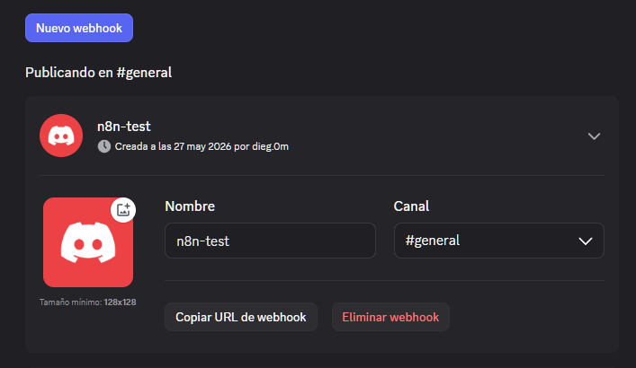

---

### Paso 2 — Agregar el nodo Discord al workflow en n8n

Con el workflow `Hola Mundo` abierto en el editor, se añadió un tercer nodo al final de la cadena:

1. Hacer clic en el botón **"+"** a la derecha del nodo `Set`.
2. Buscar **"Discord"** en el panel de nodos.
3. Seleccionar el nodo **"Discord"**.
4. En la configuración del nodo, seleccionar la acción **"Send a message"**.
5. En el campo **"Authentication"**, seleccionar **"Webhook"**.
6. En **"Webhook URI"**, pegar la URL del Webhook copiada desde Discord.
7. En el campo **"Message"**, escribir el mensaje que se enviará. Se puede usar una expresión para referenciar datos del nodo anterior:

```
*Hola Mundo desde n8n*
Estado: {{ $json.estado }}
Instalación: {{ $json.instalacion }}
Autor: {{ $json.autor }}
```

8. Hacer clic en **"Save"** para guardar el workflow actualizado.


> 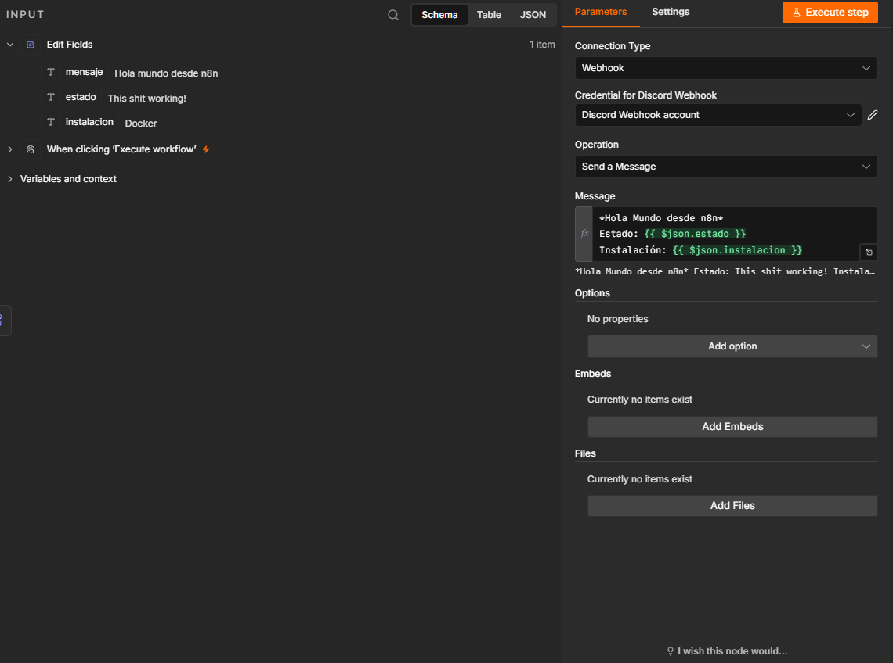

---

### Paso 3 — Ejecutar el workflow completo

Con los 3 nodos conectados, se hizo clic en **"Execute Workflow"**. El flujo ahora:

1. El **Manual Trigger** inicia la ejecución.
2. El nodo **Set** genera el objeto JSON con el mensaje.
3. El nodo **Discord** toma los datos del Set y los envía al canal de Discord vía Webhook.

> 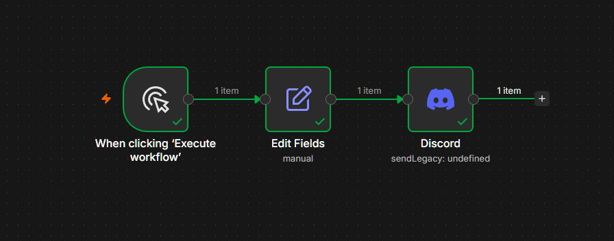

---

### Paso 4 — Verificar el mensaje en Discord

Al revisar el canal de Discord configurado, se pudo ver el mensaje enviado automáticamente por n8n.

> 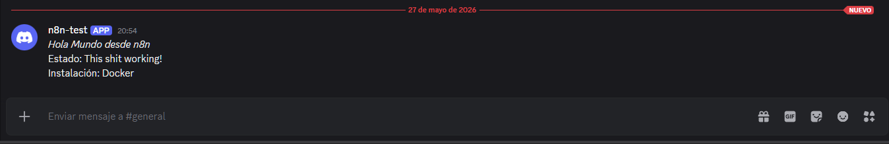

---

### Diagrama del Workflow con Discord

```
┌──────────────────┐     ┌──────────────────┐     ┌──────────────────┐
│                  │     │                  │     │                  │
│  Manual Trigger  │────▶│  Set: Hola Mundo │────▶│  Discord         │
│  (Inicio manual) │     │  (Genera JSON)   │     │  (Envía mensaje) │
│                  │     │                  │     │                  │
└──────────────────┘     └──────────────────┘     └──────────────────┘
       Paso 1                  Paso 2                    Paso 3
```

### Resumen del nodo Discord

| Propiedad | Valor |
|-----------|-------|
| **Tipo** | Discord |
| **Acción** | Send a message |
| **Autenticación** | Webhook |
| **Webhook URI** | URL copiada desde Discord (privada) |
| **Mensaje** | Texto con expresiones que referencian datos del nodo Set |

---

## Evidencias

### 1. Docker Desktop con el contenedor n8n activo


---

### 2. Dashboard de n8n en el navegador


---

### 3. Workflow creado en el editor

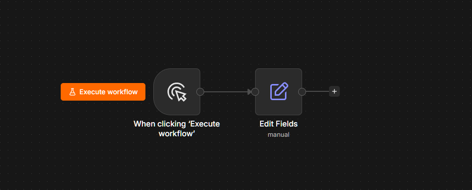

---

### 4. Configuración del nodo Set

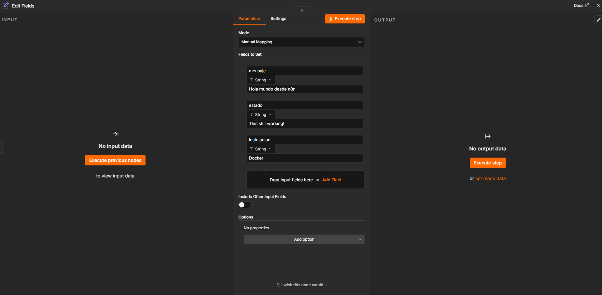

---

### 5. Ejecución exitosa del workflow

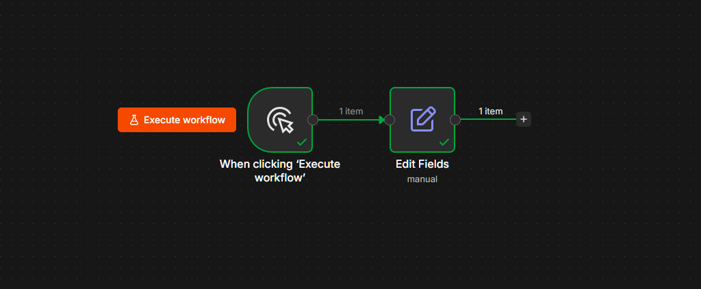

---

### 6. Output del nodo — JSON con el mensaje

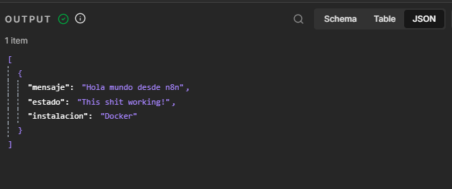

---

### 7. Webhook de Discord configurado

> 

---

### 8. Nodo Discord configurado en n8n

> `

---

### 9. Workflow completo con los 3 nodos ejecutado exitosamente

> `

---

### 10. Mensaje recibido en el canal de Discord

> `

---

## Reflexión Final

### 1. ¿Qué fue lo más difícil de la instalación?

El mayor desafío al usar Docker fue comprender la configuración del archivo `docker-compose.yml`, especialmente la parte de los volúmenes para la persistencia de datos. También fue importante asegurarse de que Docker Desktop estuviera corriendo antes de ejecutar cualquier comando, ya que si el daemon de Docker no está activo, todos los comandos fallan. Una vez comprendida la estructura del archivo Compose, el proceso es muy repetible y predecible.

---

### 2. ¿Qué ventajas tiene n8n?

n8n presenta múltiples ventajas como herramienta de automatización:

- **Open Source y auto-hospedable:** A diferencia de herramientas como Zapier o Make, n8n puede instalarse en servidores propios, garantizando privacidad y control total sobre los datos y flujos.
- **Interfaz visual intuitiva:** El editor basado en nodos permite construir flujos complejos sin necesidad de escribir código, aunque también permite usar JavaScript para lógica avanzada.
- **Gran cantidad de integraciones:** Cuenta con más de 400 integraciones nativas (Slack, Gmail, GitHub, bases de datos, APIs, IA, etc.).
- **Gratuito en self-hosted:** La versión instalada en servidor propio es completamente gratuita.
- **Ideal para Docker:** La imagen oficial de n8n está optimizada para contenedores, facilitando el despliegue en cualquier servidor.

---

### 3. ¿Qué diferencia encontraron entre Docker y local?

| Aspecto | Instalación Local (npm) | Docker |
|---------|------------------------|--------|
| **Facilidad de inicio** | Más rápido: solo `npm install -g n8n` | Requiere instalar Docker Desktop y crear el archivo Compose |
| **Aislamiento del sistema** | Corre en el OS, puede haber conflictos de versiones | Completamente aislado en su propio contenedor |
| **Portabilidad** | Depende del Node.js instalado en la máquina | El mismo `docker-compose.yml` funciona igual en cualquier máquina |
| **Actualizaciones** | `npm update -g n8n` | `docker compose pull && docker compose up -d` |
| **Persistencia de datos** | Datos en `~/.n8n/` de forma automática | Requiere configurar volúmenes, pero son más controlables |
| **Reinicio automático** | Hay que iniciar manualmente cada vez | `restart: unless-stopped` lo hace automático |
| **Ideal para** | Aprendizaje rápido y desarrollo personal | Producción, equipos y servidores |

---

### 4. ¿Para qué casos reales usarían automatización?

La automatización con n8n tiene aplicaciones concretas en múltiples escenarios:

- **Notificaciones automáticas:** Enviar un mensaje a Telegram o Slack cada vez que alguien llena un formulario de Google Forms o se genera una venta en una tienda online.
- **Reportes automáticos:** Generar y enviar por email un reporte semanal de métricas extrayendo datos de hojas de cálculo o bases de datos.
- **Monitoreo de sistemas:** Revisar el estado de una API o servidor cada cierto tiempo y notificar al equipo técnico si hay una falla.
- **Gestión de leads:** Cuando alguien se registra en un sitio web, automatizar su alta en el CRM, enviarle un email de bienvenida y crear una tarea en Trello para el equipo de ventas.

---

### 5. ¿Qué les gustaría automatizar en el futuro?

En el futuro me gustaría usar Docker para desplegar n8n en un VPS y mantenerlo funcionando 24/7. Mi objetivo sería automatizar rutas de aprendizaje, creando recordatorios inteligentes, planes de estudio automáticos y seguimiento del progreso usando herramientas como Google Calendar, Telegram e inteligencia artificial. También podría automatizar alertas sobre nuevas tecnologías u oportunidades relacionadas con programación.

---

## Estructura del Repositorio

```
n8n-docker/
 ┣ README.md
 ┣ docker-compose.yml
 ┗ screenshots/
    ┣ docker-versions.png
    ┣ docker-carpet.png
    ┣ config.png
    ┣ docker-start1.png
    ┣ docker-start2.png
    ┣ docker-ps.png
    ┣ n8n-dashboard.png
    ┣ docker-solve.png
    ┣ workflow.png
    ┣ nodos.png
    ┣ done.png
    ┣ json.png
    ┣ discord-webhook.png
    ┣ discord-nodo-config.png
    ┣ done-wdc.png
    ┗ discord-message.png
```

---

## Referencias

- [Documentación oficial de n8n — Docker](https://docs.n8n.io/hosting/installation/docker/)
- [Nodo Discord en n8n](https://docs.n8n.io/integrations/builtin/app-nodes/n8n-nodes-base.discord/)
- [Webhooks de Discord](https://support.discord.com/hc/en-us/articles/228383668-Intro-to-Webhooks)
- [Imagen oficial de n8n en Docker Hub](https://hub.docker.com/r/n8nio/n8n)
- [Docker Desktop](https://www.docker.com/products/docker-desktop/)
- [Comunidad de n8n](https://community.n8n.io/)